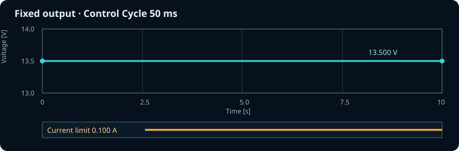
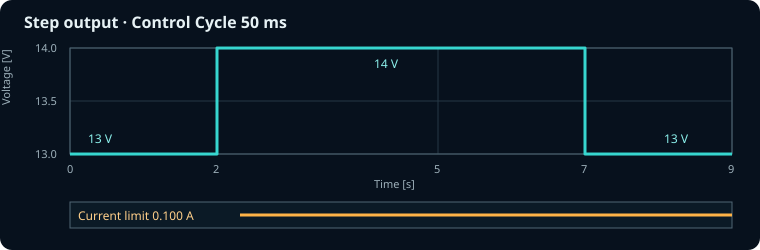
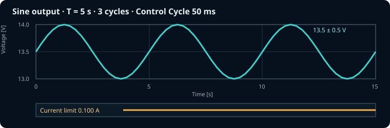
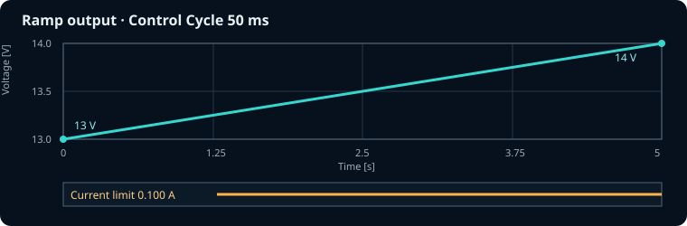

# FNIRSI DPS-150 Python Wave Control

FNIRSI DPS-150をUSB接続し、Chrome / Edgeの画面に書いたPythonで電圧・電流指令を生成する静的Webアプリです。DPS-150との通信はWeb Serial APIを使ってブラウザとUSBデバイスの間だけで行い、測定値を外部サーバーへ送信しません。

この`feature/python-control-ui`ブランチはPython制御版です。`main`の安定版は変更せず残し、GitHub Pagesの別パスへ公開しています。

Python版URL（GitHub Pages）:

<https://1999tanaka.github.io/DPS150/python/>

安定版URL:

<https://1999tanaka.github.io/DPS150/>

## 重要な安全上の注意

- 実験前に、負荷へ適合する **Vmax** と **Amax**、DPS-150本体のOVP / OCP等を設定してください。Pythonの戻り値はこの上限を超えないか送信前に検査します。
- 初回は固定5 V、OUTPUT ON/OFF、少ないループ回数の順に確認し、最初から長時間のジェネレーターを実行しないでください。
- STOP、正常終了、通信エラー時にはOUTPUT OFFを送信します。ただしUSB抜去、ブラウザ終了、PCスリープ等では、WebアプリからのOUTPUT OFFを保証できません。
- Command Voltageは設定指令値です。実際のアナログ出力波形はオシロスコープやデータロガーで確認してください。
- 本アプリのDPS-150実機での最終検証は、利用者の機器・負荷・ファームウェア環境で実施してください。

## 使い方

1. DPS-150を会社PCへUSB接続します。
2. ChromeまたはEdgeで上記GitHub Pages URLを開きます。
3. `CONNECT DEVICE`を押し、DPS-150のシリアルポートを選択します。
4. 試験対象に適したVmaxとAmax、Control Cycleを入力します。
5. 画面の`control.py`へ電圧・電流の制御式を書き、`CHECK PYTHON`で構文と初期値を確認します。
6. `control(Vmax, Amax)`ジェネレーターの内容を確認して`START`を押します。
7. 確認画面で配線と安全上限の確認にチェックし、`START OUTPUT`を押します。
8. 実行中はページを前面に保ち、PCをスリープさせないでください。
9. 終了後、必要に応じて`DOWNLOAD CSV`からログを保存します。

会社PCへのPython、Node.js、専用アプリのインストールは不要です。同梱したPyodideがPythonをWebAssemblyとしてブラウザ内で実行します。Web SerialはSecure Contextが必要なため、GitHub PagesのHTTPS URLから利用してください。FirefoxとSafariは対象外です。

## Python制御コード

画面で選択したControl Cycleごとに、次のジェネレーターから1個の指令を取り出します。

```python
def control(Vmax, Amax):
    Imax = 100

    for i in range(10000):
        if i >= Imax:
            break

        A = min(Amax, 0.100)
        V = min(Vmax, 13.0 + 0.01 * i)
        yield A, V
```

`Vmax`と`Amax`は画面で指定した上限です。`i`はPython自身の`for`ループで管理します。各回の指令は電流制限を先、電圧を後にした`yield A, V`または`yield {"A": A, "V": V}`です。`break`、`range()`の終了、関数末尾への到達で正常終了し、OUTPUT OFFします。

Python内に`time.sleep()`を書く必要はありません。画面側がControl Cycleの時間だけ待ってからジェネレーターを次へ進めます。Python側でもsleepするとその時間が追加され、周期が長くなるため使用しないでください。

## サンプルプログラム

以下はWeb画面の`control.py`欄へそのまま貼り付けられます。すべて`A`が電流制限[A]、`V`が設定電圧[V]で、`yield A, V`の順です。画面で指定したVmax・Amaxを超えないように制限しています。

実行時間の目安は次式です。

```text
実行時間 [s] ≒ yield回数 × Control Cycle [ms] / 1000
```

Python計算とシリアル通信のため、実際の実行時間は多少長くなることがあります。`for`の終了、`break`、またはSTOPで制御を終了し、DPS-150へOUTPUT OFFを送ります。

### 固定電圧・固定電流制限

13.5 V、電流制限0.100 Aを200回出力します。Control Cycleが50 msの場合は約10秒です。



```python
def control(Vmax, Amax):
    A = min(Amax, 0.100)
    V = max(0.0, min(Vmax, 13.500))

    for i in range(200):
        yield A, V
```

### ステップ電圧

13 Vを40回、14 Vを100回、13 Vを40回出力します。Control Cycleが50 msの場合は2秒、5秒、2秒のステップになります。



```python
def control(Vmax, Amax):
    A = min(Amax, 0.100)
    sequence = [
        (13.0, 40),
        (14.0, 100),
        (13.0, 40),
    ]

    for voltage, count in sequence:
        V = max(0.0, min(Vmax, voltage))
        for i in range(count):
            yield A, V
```

### サイン波

中心13.5 V、振幅0.5 Vのサイン波を3周期出力します。1周期100点なので、Control Cycleが50 msの場合の周期は5秒です。



```python
import math

def control(Vmax, Amax):
    A = min(Amax, 0.100)
    center = 13.5
    amplitude = 0.5
    points_per_period = 100
    cycles = 3

    for i in range(points_per_period * cycles):
        phase = 2.0 * math.pi * i / points_per_period
        voltage = center + amplitude * math.sin(phase)
        V = max(0.0, min(Vmax, voltage))
        yield A, V
```

サイン波の実際の周期は次式で決まります。

```text
周期 [s] = points_per_period × Control Cycle [ms] / 1000
```

### ランプ電圧

13 Vから14 Vまで100ステップで直線的に上昇させます。Control Cycleが50 msの場合は約5秒です。



```python
def control(Vmax, Amax):
    A = min(Amax, 0.100)
    start_voltage = 13.0
    end_voltage = 14.0
    steps = 100

    for i in range(steps + 1):
        voltage = start_voltage + (end_voltage - start_voltage) * i / steps
        V = max(0.0, min(Vmax, voltage))
        yield A, V
```

`A = 3`のようにAmaxを超える電流制限を返すと、安全チェックによってDPS-150へ送信せず異常停止します。通常は各サンプルのように`A = min(Amax, 希望電流)`としてください。

PythonはUIやSTOP処理とは別のWeb Workerで動きます。コード準備が3秒、1回の制御計算が750 msを超えた場合はWorkerを強制終了し、DPS-150へOUTPUT OFFを送ります。電圧は0 V以上かつVmax・機器上限以下、電流は0 Aより大きくAmax・機器上限以下でなければ送信しません。外部パッケージのダウンロードは行わず、同梱されたPython標準ライブラリだけを対象とします。

## デフォルト制御条件

| 項目 | デフォルト |
| --- | ---: |
| Vmax | 14.000 V |
| Amax | 0.100 A |
| Control Cycle | 50 ms |
| 終了条件 | `break`またはジェネレーター終了 |
| 指令順序 | `yield A, V` |

Control Cycleは`performance.now()`を基準にスケジュールします。Python計算やシリアル通信が指定周期より長い場合、遅れた回を短時間にまとめて実行せず、次回を指定周期後へ送り直します。

## 実装機能

- Web Serialによる115200 bps接続、セッション初期化、機器情報取得
- 電圧・Current Limit設定、OUTPUT ON/OFF
- Vmax / AmaxとPythonの`for i in range(...)`を使った周期制御
- WebUI内のPythonによる電流制限・電圧指令生成と`break`による正常終了
- Pythonを分離Workerで実行し、ハング時はWorker終了・OUTPUT OFF
- Python指令値の有限値・電圧上限・電流安全上限チェック
- STOP最優先制御、二重START防止、実行中の設定ロック
- 0～機器報告上限Vの送信前チェック
- USB切断、送受信タイムアウト、保護状態検出時の異常停止
- OUTPUT ON/OFFの機器応答確認と、未確認時の状態読出し・1回再送
- Command / Measured Voltageの30秒固定Canvasリアルタイムグラフ（最大10,000点）
- Current Limit / Measured Currentの30秒固定・自動スケールCanvasグラフ（最大10,000点）
- レジスタ0xC3を50 ms周期（目標20 Hz）で明示読出し
- DPS-150から届いた実測点のみを受信時刻で表示し、実測点間は補間・接続しない
- 実測の生データ更新レートを画面表示
- Command / Measuredの電圧・電流数値、Measured Power、実行回数・経過時間表示
- Wake Lock（利用可能なブラウザのみ）とページ離脱警告
- 指令行と実測行を区別し、受信時刻・実測サンプル番号を含む最大250,000件のCSVログ
- Pyodide 314.0.6をリポジトリ内に同梱（外部CDN不使用）
- 外部API、サーバー側データベース不使用

## ファイル構成

```text
index.html
css/
  style.css
js/
  main.js          UIとイベント連携
  dps150.js        Web Serial・DPS-150プロトコル
  waveform.js      Vmax / Amax / Control Cycleの設定検証
  experiment.js    Python周期制御・安全停止
  graph.js         Canvasグラフ
  logger.js        ログ・CSV
  python-control.js Python Workerとの安全な要求・タイムアウト管理
  python-worker.js  Pyodide上でcontrol()を実行
vendor/pyodide/     同梱したPyodide 314.0.6 core runtime
tests/
  *.test.js        波形、パケット、CSVの単体テスト
.github/workflows/
  pages.yml        テストとGitHub Pages公開
```

## 通信プロトコル

送信フレームは次の形式です。

```text
F1 <command> <register> <length> <data...> <checksum>
```

- Baud rate: 115200
- Data: 8 bit、parity none、stop bit 1
- Flow control: hardware
- Float: IEEE-754 float32 little-endian
- Checksum: `(register + length + sum(data)) & 0xff`
- Output ON: `F1 B1 DB 01 01 DD`（OFFはデータ`00`）

Current Limit、初期電圧、OUTPUT ON等の制御遷移には60 msのコマンド間隔を設けています。実行中は選択したControl CycleごとにPythonを呼び出します。

通信レジスタとフレーム形式は、cho45氏のMITライセンス実装 [cho45/fnirsi-dps-150](https://github.com/cho45/fnirsi-dps-150) を参考にしています。詳細は[THIRD_PARTY_NOTICES.md](THIRD_PARTY_NOTICES.md)を参照してください。プロトコルは非公式のリバースエンジニアリング情報であり、FNIRSI公式仕様ではありません。

実測V/I/Pの20 Hz読出しは、実機向けロガーで同じ`0xC3`を50 ms周期・最大約20 Hzとしている [cajunpanda/dps150](https://github.com/cajunpanda/dps150/blob/main/dps150.py#L433-L476) も参考にしています。本アプリでは実際の受信Hzを画面表示し、機器・ファームウェアごとの差を実機で確認できるようにしています。

## 開発と確認

このアプリはビルド不要の静的ファイルです。開発環境にNode.js 22以降がある場合のみ、次の確認を実行できます（利用者PCでは不要です）。

```bash
npm run check
npm test
```

`main`へpushするとGitHub Actionsが構文チェックと単体テストを実行し、成功後にGitHub Pagesへ公開します。

## ライセンス

このプロジェクトはMIT Licenseです。DPS-150通信実装の参考元に関する表示は[THIRD_PARTY_NOTICES.md](THIRD_PARTY_NOTICES.md)に含まれます。
